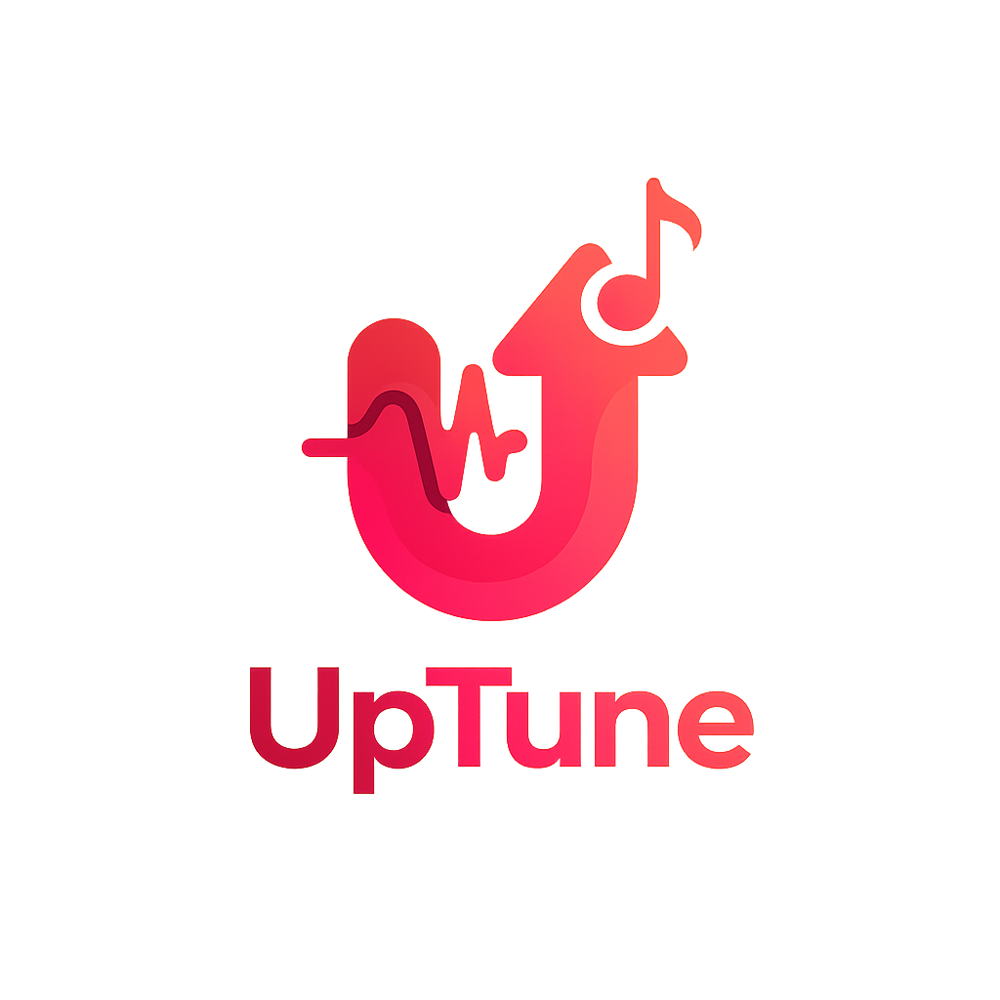

# UpTune

  

  <b>An open-source, feature-packed music streaming and library manager built with Flutter.</b>

  
  
  

---

## Overview

UpTune is a modern music experience for desktop and mobile users. It combines beautiful design, powerful discovery tools, and offline-first capabilities. The project started as a community fork of the Bloomee player and has evolved into a fully-fledged application for curated listening, playlist management, and social sharing.

> **Disclaimer:** UpTune is developed and shared strictly for educational purposes. Please respect all applicable copyright laws and licensing terms when using the application or its source code.

## Key Features

- **Cross-Platform Flutter App** – Runs on Android, Windows, Linux, and the web.
- **Personalised Explore Feed** – Surfacing trending tracks, charts, and curated playlists.
- **Robust Music Player** – Background playback, queue management, sleep timer, and recent history.
- **Offline Downloads** – Download songs with quality selection and metadata embedding.
- **Playlist & Library Tools** – Create playlists, manage likes, and organise your favourites.
- **Lyrics & Metadata** – Fetch lyrics, song artwork, and detailed credits for deeper context.
- **Social Listening** – Friend system, shared listening sessions, and activity feed.
- **Notifications & Update Center** – Stay in sync with new releases and changelog highlights.
- **Rich Theming** – Adaptive UI, glassmorphism touches, and iconography tuned for the UpTune brand.

## Screenshots

  

## Getting Started

### Prerequisites

- [Flutter](https://flutter.dev/docs/get-started/install) SDK `>= 3.0.6 < 4.0.0`
- Dart `>= 3.0.6`
- A recent version of Android Studio, Visual Studio Code, or another Flutter-ready IDE
- For desktop builds: platform-specific toolchains (Xcode for macOS, Visual Studio for Windows, etc.)

## License

This project is licensed under the terms of the [GNU General Public License v3.0](LICENSE).

You are free to use, modify, and distribute this software in accordance with the GPLv3 requirements.

## Acknowledgements

- Original Bloomee project and contributors for the foundation.
- Community maintainers and testers who help shape UpTune.
- Flutter and Dart teams for making cross-platform development a joy.

---

  Built with ❤️ by the UpTune community.

